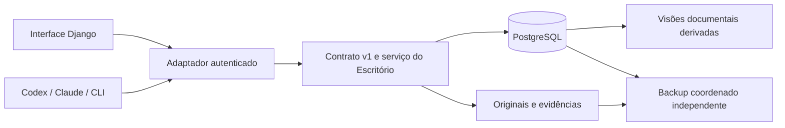

# Arquitetura — Escritório v2 e SuperSync

## Decisão proposta e evidências

Reutilizar a família tecnológica do SuperSync para interface e identidade, mantendo contrato e núcleo do Escritório independentes do fornecedor de IA. A integração é proposta; não foi implementada. O piloto atual usa servidor HTTP Python independente, psycopg 3 e JSON Schema; não é um app Django pronto.

| Camada | Base observada / direção proposta |
|---|---|
| Frontend | Templates Django, Bootstrap/Tabler e ativos estáticos existentes. |
| Backend web | Python 3.11 (Dockerfile SuperSync), Django 5.2.7 e DRF 3.16.1 observados em requirements. Validar runtime e política de atualização antes de homologar. |
| Núcleo atual | Python 3.10+, psycopg 3.3.6, jsonschema 4.26.0; manter inicialmente em ambiente separado. |
| Banco | PostgreSQL dedicado logicamente ao Escritório; mesma instância do SuperSync somente após avaliação. Schema separado é alternativa a justificar. |
| Arquivos | Volume persistente local na homologação inicial; armazenamento central e cópia externa a definir. |
| Assíncrono | Celery existente pode apoiar exportação/backup no futuro; não tornar ações interativas dependentes de filas sem necessidade. |

Versões citadas são observadas, não recomendação de versões mais recentes nem homologação de produção. Não juntar requirements dos dois sistemas: SuperSync usa psycopg2 e o piloto psycopg3 em ambientes distintos.

## Fluxo



A identidade estável do SuperSync será mapeada a pessoas/membros do Escritório por integração documentada. Não adivinhar modelos ou endpoints de login. Adaptador aplica autenticação, CSRF nas sessões web e autorização; serviço revalida permissão por operação. Não expor token técnico no navegador.

Inicialmente encapsular o núcleo existente por uma interface de serviço. Escolher, mediante prova de compatibilidade, entre serviço separado autenticado e integração em processo. O servidor `http_local.py` não pode ser usado como servidor de produção.

## Autoridade e sincronização

Hoje Markdown é oficial; banco demonstrativo e ensaio não o substituem. Após corte explícito: estado, prazo, responsável, dependências e histórico operacional são gravados primeiro no PostgreSQL. Markdown conserva regras, requisitos e narrativa documental; resumos operacionais são derivados, identificados por fonte/versão/data. Sem atualização bidirecional. Banco central atende clientes de várias máquinas; Git sincroniza código/documentação, não bancos ativos.

Transações agrupam operação, registro e histórico. UUID/chave estáveis evitam duplicação; versão esperada evita sobrescrita concorrente. Arquivo e banco não constituem uma transação única: preparar → enviar → verificar → vincular, com recuperação explícita. Download revalida integridade. Originais imutáveis possuem ID/checksum.

## Organização proposta

```text
escritorio/                 # app Django proposto, ainda inexistente no SuperSync
  api/                     # serializers, views e permissões do contrato
  services/                # adaptadores e casos de uso; regras centralizadas
  integrations/            # identidade SuperSync e cliente do núcleo
  migrations/              # somente modelo aprovado; não duplicar schema SQL
  management/commands/     # importar, reconciliar, exportar
  tests/                   # permissão, contrato, concorrência e restauração
  urls.py
templates/escritorio/
static/escritorio/
```

Antes de criar models/migrations Django, decidir o proprietário do schema: preservar migrations SQL existentes ou migrar sua gestão de forma explícita. Nunca permitir que SQL e Django gerenciem as mesmas tabelas independentemente.

## Segurança e implantação

Papéis de gestor/executor/consulta por portfólio; acesso técnico separado e limitado ao autorizado. Credenciais administrativas só para instalação/migração controlada; serviço usa papel mínimo. Sanitizar logs. Definir TLS, armazenamento, retenção, monitoramento e reversão na infraestrutura real. Restauração deve verificar banco, originais, vínculos e aprovações em destino novo. Não iniciar implantação central por este documento.

## Fontes e validade

Preparado em 08/10/2026 para o Escritório v2 com integração proposta ao SuperSync. Documento de preparação: não promove a iniciativa a projeto nem autoriza produção.

Fontes no Escritório: `CONTEXTO.md`, `AGENTS.md`, `arquitetura/v2/{especificacao,modelo-dados,implementacao-supersync,operacao-gestor,seguranca-chat}.md`, `desenvolvimento/contratos/openapi.json`, `desenvolvimento/migrations/`, `desenvolvimento/servico/`, `portfolios/saerj/projetos/supersync/desenvolvimento.md`. Fontes de implementação consultadas em `C:/Users/fabri/Projetos/supersync`: `AGENTS.md`, `requirements.txt`, `Dockerfile` e inventário de diretórios; HEAD observado `12f6dae`. Não foram lidos .env, dumps ou segredos, nem validados autenticação, infraestrutura remota ou comportamento do checkout completo. A inspeção documental anterior cita `bba8f83`; não a tratar como HEAD atual.
